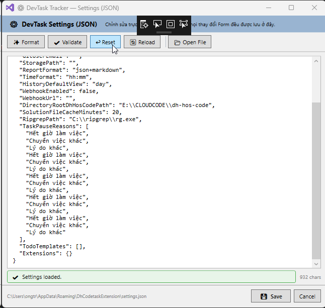
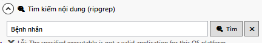

### Tuân thủ:

- docs\rule.md
- docs\Instructions.md
- docs\error-skill-devtasktracker.md (không để lỗi xảy ra)

### Thực hiện tiếp tục:

- [ ]: Bị trùng cấu hình, khi mở lên nhiều lần thì bị trùng, trong phần settings
  

```
"TaskPauseReasons": [
    "Hết giờ làm việc",
    "Chuyển việc khác",
    "Lý do khác",
    "Hết giờ làm việc",
    "Chuyển việc khác",
    "Lý do khác",
    "Hết giờ làm việc",
    "Chuyển việc khác",
    "Lý do khác",
    "Hết giờ làm việc",
    "Chuyển việc khác",
    "Lý do khác",
    "Hết giờ làm việc",
    "Chuyển việc khác",
    "Lý do khác"
  ],
```

- [ ]: Chỉnh lỗi khi search text:

```
System.ComponentModel.Win32Exception: 'The specified executable is not a valid application for this OS platform.'
private static List<RipgrepSearchResult> RunRipgrep(
            string rgPath, string pattern, string root, CancellationToken ct)
        {
            var results = new List<RipgrepSearchResult>();

            // Build args: --json for structured output, limit results to avoid overwhelming UI
            var args = string.Format("--json --line-number --max-count 500 \"{0}\" \"{1}\"",
                pattern.Replace("\"", "\\\""), root);

            var psi = new ProcessStartInfo(rgPath, args)
            {
                UseShellExecute        = false,
                RedirectStandardOutput = true,
                RedirectStandardError  = true,
                CreateNoWindow         = true,
                StandardOutputEncoding = Encoding.UTF8
            };

            using (var proc = Process.Start(psi))

```

- [ ]: Cải tiện search path sln và csproj vẫn còn chậm lắm, nếu không cải thiện chậm được thì tổ chức thêm button để bắt đầu tìm, khỏi textchange là search
- [ ]: Thay đổi chức năng search text: đưa lên thành 1 loại cùng cấp với `sln`, và `project`, mục tiêu để giao diện rộng rãi hơn 
